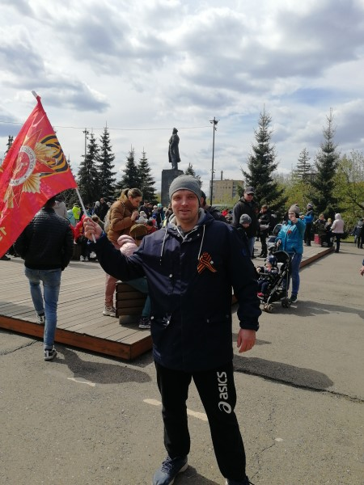

# Обо мне

## Здравствуйте, здесь я хочу рассказать немного о себе как о программисте

Меня зовут **Максим** мне 36 лет. Я с детства увлекаюсь программированием, после того как мама отвела меня на платные занятия по Pascal. Мне сразу понравилось это дело, и я начал создавать свои первые программы. После школы родители настояли, чтобы я поступил на техническую специальность "Инженер-механик машиностроения" в институт. Я отучился 3 года, после чего взял академ, и ушёл в армию. После армии я решил, что буду заниматься любимым делом, и перевёлся на заочный факультет информационных технологий на программиста. Я отучился 6 лет и параллельно работал у родителей, они занимаются торговлей. На работе я освоил 1С, переделав код под наши задачи. После этого написал комплекс своих программ в Delphi, чтобы полностью уйти от 1С. Сейчас я учусь в Нетологии на курсе "Fullstack-разработчик на Python".

## Чем я занимаюсь в свободное время

Я разносторонний человек, у меня много интересов. Я люблю спорт, особенно мне нравятся боевые искусства. Я живу в своем доме, поэтому много работы связано со стройкой и со столярным делом. Также у меня свой Зимний сад и я занимаюсь выращиванием фруктовых экзотических растений. Увлекаюсь электроникой - Pic-контроллере, Arduino.
